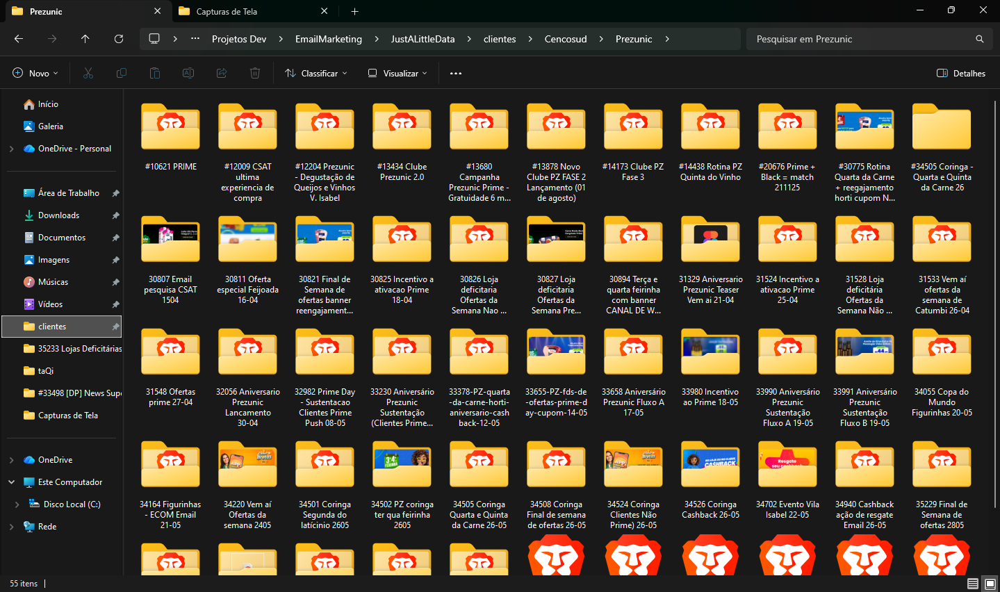
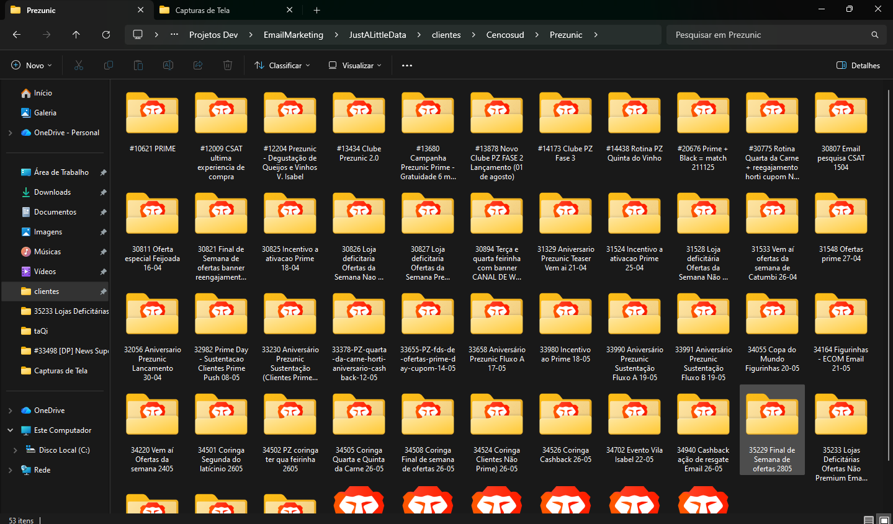
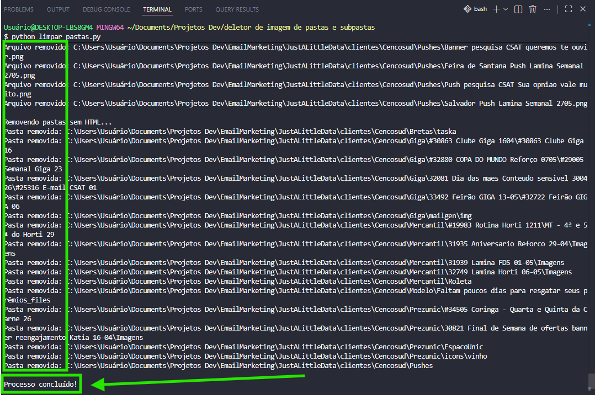
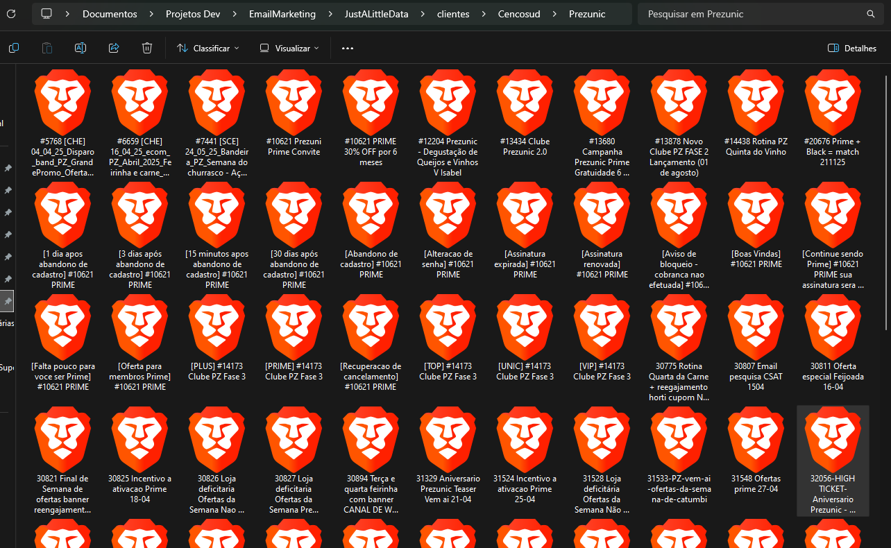
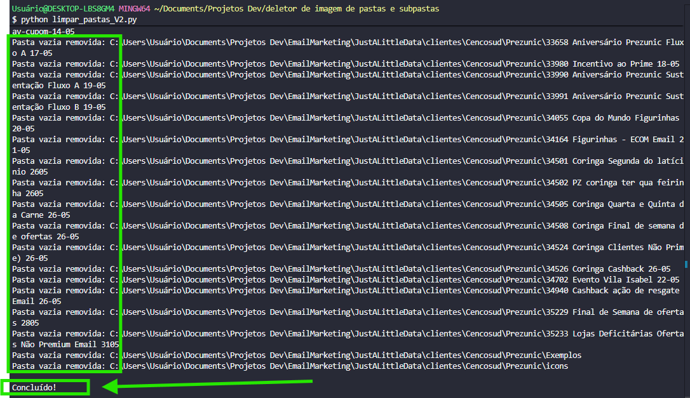

# 🗂️ Organizador de Arquivos HTML

Projeto desenvolvido para limpeza e reorganização de estruturas de pastas contendo arquivos HTML, imagens e outros arquivos auxiliares após uma necessidade que tive onde gostaria de deletar todos os arquivos que não fosse HTML e depois colocá-los em uma pasta só, já que todos estava em subpastas diferentes.

---

## 🚀 Funcionalidades

### 1. Remoção de arquivos específicos

Script:

```bash
deleta_arquivos_especificados.py
```

Remove automaticamente arquivos que não são necessários e deixa somente aqruivos HTMLs.

Arquivos removidos:

- JPG
- JPEG
- PNG
- GIF
- BMP
- WEBP
- SVG
- TIFF
- ICO
- CSV
- XLSX
- PDF
- TXT

Após a remoção:

- Pastas que não possuem nenhum arquivo HTML são excluídas.
- Pastas vazias são removidas.

---

### 2. Reorganização dos HTMLs

Script:

```bash
reorganiza_HTMLS.py
```

Percorre todas as subpastas e move os arquivos HTML para a pasta principal do projeto.

Também trata conflitos de nomes automaticamente:

```text
index.html
index_1.html
index_2.html
...
```

Após a movimentação:

- Subpastas vazias são removidas.
- Todos os HTMLs ficam concentrados em um único diretório.

---

## 📂 Fluxo do Processo

### Estado Inicial

Estrutura original contendo diversas subpastas e arquivos auxiliares.



---

### Após remover os arquivos especificados

São removidas imagens, PDFs, planilhas e outros arquivos não desejados.




---

### Após reorganizar os HTMLs

Todos os HTMLs são movidos para a pasta principal.




---

## ▶️ Como executar

### Executar limpeza

```bash
python deleta_arquivos_especificados.py
```

### Executar reorganização

```bash
python reorganiza_HTMLS.py
```

---

## 📁 Estrutura do Projeto

```text
.
├── deleta_arquivos_especificados.py
├── reorganiza_HTMLS.py
├── README.md
└── imagens
    ├── estado_inicial.png
    ├── Pasta_depois_de_deletar_os_arquivos_especificados.png
    ├── Pasta_depois_de_reorganizar_os_htmls.png
    ├── Terminal_depois_de_deletar_os_arquivos_especificados.png
    └── Terminal_depois_de_reorganizar_os_htmls.png
```

---

## 🛠️ Tecnologias

- Python 3
- os
- shutil

---

## 📌 Caso de Uso

Este projeto foi criado para tratamento em massa de emails marketing em HTML, permitindo:

- Limpeza de arquivos desnecessários;
- Redução da quantidade de diretórios;
- Centralização dos HTMLs;
- Facilitação de consultas posteriores.